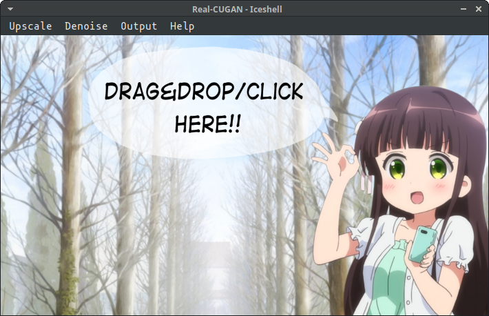

# Iceshell

Iceshell is a GUI program that upscales and denoises anime-style images. Iceshell allows you to choose among 3 different AI super-resolution models: Real-CUGAN, Real-ESRGAN and Waifu2x

Iceshell is available on Linux and Windows.



This program can make your images better and sharper! Below is a comparison of different upscalers' performance. Imagemagick upscale is the result you would get from a conventional image manipulation program such as Krita or Photoshop, which doesn't use AI model.

Original image vs ImageMagick vs Real-CUGAN vs Real-ESRGAN vs Waifu2x:


A GPU is required to run this program.

## Installation

>Python

Download the repository and install PyQt5:
```
git clone https://github.com/eli0009/iceshell
pip3 install PyQt5
```

## Usage

>Python

Go to the install directory and run iceshell.py:
```
cd iceshell
python3 iceshell.py
```

JPG, JPEG, PNG and WEBP image formats are supported.

Either drag & drop your images or select them by clicking on the main window. Upscaled images are outputted to the same folder as the input by default.

## About the Upscalers

[Real-CUGAN](https://github.com/bilibili/ailab/tree/main/Real-CUGAN) is an AI super resolution model for anime images, trained in a million scale anime dataset, using the same architecture as Waifu2x-CUNet

[Real-ESRGAN](https://github.com/xinntao/Real-ESRGAN) aims at developing Practical Algorithms for General Image/Video Restoration

[Waifu2x](https://github.com/nagadomi/waifu2x) is an Image Super-Resolution model for Anime-style art using Deep Convolutional Neural Networks

## Acknowledgements
- [Real-CUGAN ncnn Vulkan](https://github.com/nihui/realcugan-ncnn-vulkan) by nihui
- [Waifu2x ncnn Vulkan](https://github.com/nihui/waifu2x-ncnn-vulkan) by nihui
- [Real-ESRGAN](https://github.com/xinntao/Real-ESRGAN) by xinntao
- [BreezeStyleSheets](https://github.com/Alexhuszagh/BreezeStyleSheets)
- Qt for Python
- Qt Designer